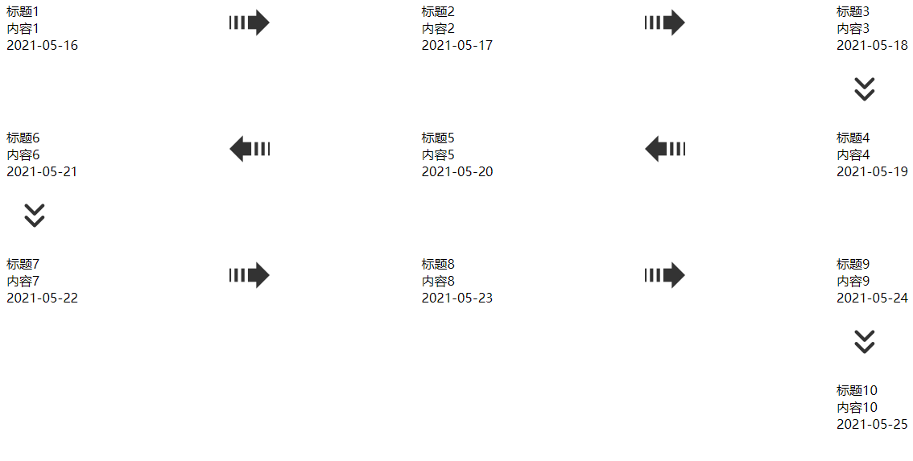
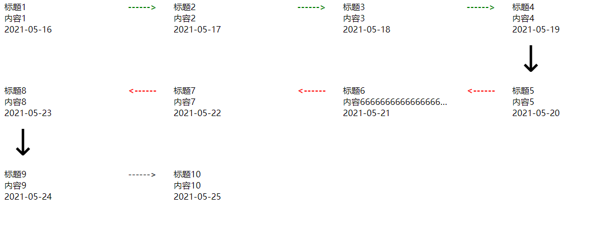

# f-snake-timeline

### Install

```
npm install f-snake-timeline -S
```


### 基础使用

```vue
<template>
  <div id="app">
    <FSnakeTimeline :list="list" />
  </div>
</template>

<script>
import FSnakeTimeline from 'f-snake-timeline'
export default {
  name: "App",
  components: {
    FSnakeTimeline,
  },
  data() {
    return {
      list: [
        { id: 1, title: "标题1", content: "内容1", timestamp: "2021-05-16" },
        { id: 2, title: "标题2", content: "内容2", timestamp: "2021-05-17" },
        { id: 3, title: "标题3", content: "内容3", timestamp: "2021-05-18" },
        { id: 4, title: "标题4", content: "内容4", timestamp: "2021-05-19" },
        { id: 5, title: "标题5", content: "内容5", timestamp: "2021-05-20" },
        { id: 6, title: "标题6", content: "内容6", timestamp: "2021-05-21" },
        { id: 7, title: "标题7", content: "内容7", timestamp: "2021-05-22" },
        { id: 8, title: "标题8", content: "内容8", timestamp: "2021-05-23" },
        { id: 9, title: "标题9", content: "内容9", timestamp: "2021-05-24" },
        { id: 10, title: "标题10", content: "内容10", timestamp: "2021-05-25" },
      ],
    };
  },
};
</script>
```



****


### 自定义内容(插槽的使用)

```vue
<template>
  <div id="app">
    <FSnakeTimeline :row-num="4" :list="list">
      <template v-slot:rightArrows="{ data }">
        <div :class="{ success: data.id < 5 }">------&gt;</div>
      </template>
      <template v-slot:leftArrows="{ data }">
        <div :class="{ error: data.id >= 5 }">&lt;------</div>
      </template>
      <template v-slot:bottomArrows>
        
      </template>
      <template v-slot:content="{ data }">
        <div class="width-200">
          <p>{{ data.title }}</p>
          <p>{{ data.content }}</p>
          <p>{{ data.timestamp }}</p>
        </div>
      </template>
    </FSnakeTimeline>
  </div>
</template>

<script>
import FSnakeTimeline from "./components/FSnakeTimeline";
export default {
  name: "App",
  components: {
    FSnakeTimeline,
  },
  data() {
    return {
      list: [
        { id: 1, title: "标题1", content: "内容1", timestamp: "2021-05-16" },
        { id: 2, title: "标题2", content: "内容2", timestamp: "2021-05-17" },
        { id: 3, title: "标题3", content: "内容3", timestamp: "2021-05-18" },
        { id: 4, title: "标题4", content: "内容4", timestamp: "2021-05-19" },
        { id: 5, title: "标题5", content: "内容5", timestamp: "2021-05-20" },
        { id: 6, title: "标题6", content: "内容666666666666666666666666666666666666666666", timestamp: "2021-05-21" },
        { id: 7, title: "标题7", content: "内容7", timestamp: "2021-05-22" },
        { id: 8, title: "标题8", content: "内容8", timestamp: "2021-05-23" },
        { id: 9, title: "标题9", content: "内容9", timestamp: "2021-05-24" },
        { id: 10, title: "标题10", content: "内容10", timestamp: "2021-05-25" },
      ],
    };
  },
};
</script>

<style lang="scss">
.width-200 {
  width: 200px;
  p {
    overflow: hidden; /*超出部分隐藏*/
    white-space: nowrap; /*不换行*/
    text-overflow: ellipsis; /*超出部分文字以...显示*/
  }
}
.bottom-img {
  width: 30px;
  padding: 20px 10px;
}
.success {
  font-weight: 700;
  color: green;
}
.error {
  font-weight: 700;
  color: red;
}
</style>


```




****

### Attributes

| 参数    | 说明         | 类型   | 可选值 | 默认值 |
| ------- | ------------ | ------ | ------ | ------ |
| list    | 渲染数据     | Array  | 必传   | []     |
| row-num | 一行渲染个数 | Number | -      | 3      |


### List 里的参数

| 参数      | 说明 | 类型   | 可选值 | 默认值 |
| --------- | ---- | ------ | ------ | ------ |
| title     | 标题 | String | -      | -      |
| content   | 内容 | String | -      | -      |
| timestamp | 时间 | String | -      | -      |


****

### Slot

| name         | 说明                                                   |
| ------------ | ------------------------------------------------------ |
| content      | 自定义主体的内容，参数为 { data } 数组里的每个元素数据 |
| leftArrows   | 自定义左箭头容器，参数为 { data } 数组里的每个元素数据 |
| rightArrows  | 自定义右箭头容器，参数为 { data } 数组里的每个元素数据 |
| bottomArrows | 自定义下箭头容器，参数为 { data } 数组里的每个元素数据 |


